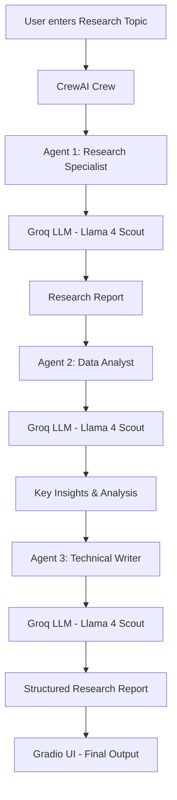

# Multi-Agent AI Research Assistant

A multi-agent AI research system where three specialized agents collaborate autonomously to research any topic and produce structured reports.

## How It Works

1. **Agent 1 — Research Specialist**: Gathers comprehensive information on the given topic
2. **Agent 2 — Data Analyst**: Analyzes findings and extracts key insights and patterns  
3. **Agent 3 — Technical Writer**: Produces a well-structured research report

## Tech Stack

- **CrewAI** — Multi-agent coordination
- **LangChain** — LLM orchestration
- **Groq LLM** — Fast inference
- **Gradio** — Interactive UI
- **Hugging Face Spaces** — Live deployment

## Live Demo

Try it here: https://huggingface.co/spaces/Digvijay8809/multi-agent-research

## Setup

1. Clone the repo
2. Create virtual environment: `python -m venv venv`
3. Activate: `venv\Scripts\activate`
4. Install dependencies: `pip install -r requirements.txt`
5. Add your Groq API key to `.env`: `GROQ_API_KEY=your_key_here`
6. Run: `python app.py`
7. Visit: `http://127.0.0.1:7860`

## How to Run Locally

1. Clone the repo
   git clone https://github.com/digvijay2004/multi-agent-research.git
   cd multi-agent-research

2. Create virtual environment
   python -m venv venv
   venv\Scripts\activate

3. Install dependencies
   pip install -r requirements.txt

4. Add your Groq API key to .env
   GROQ_API_KEY=your_key_here

5. Run the app
   python app.py

6. Visit http://127.0.0.1:7860
